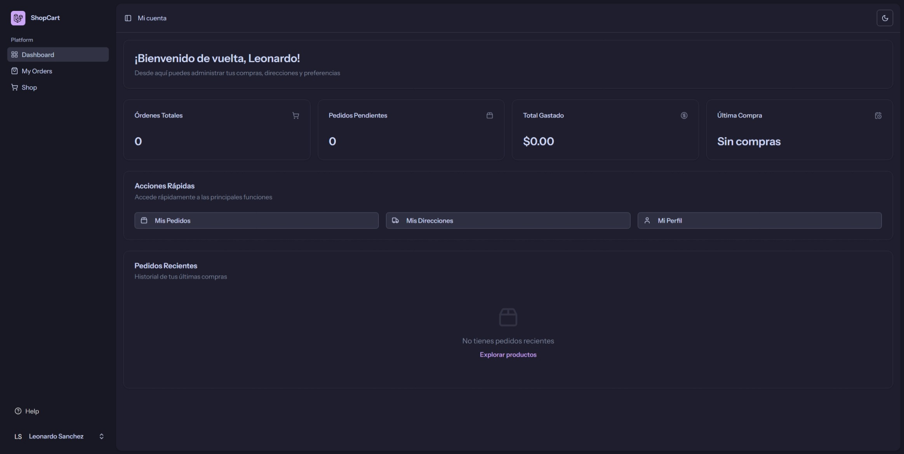
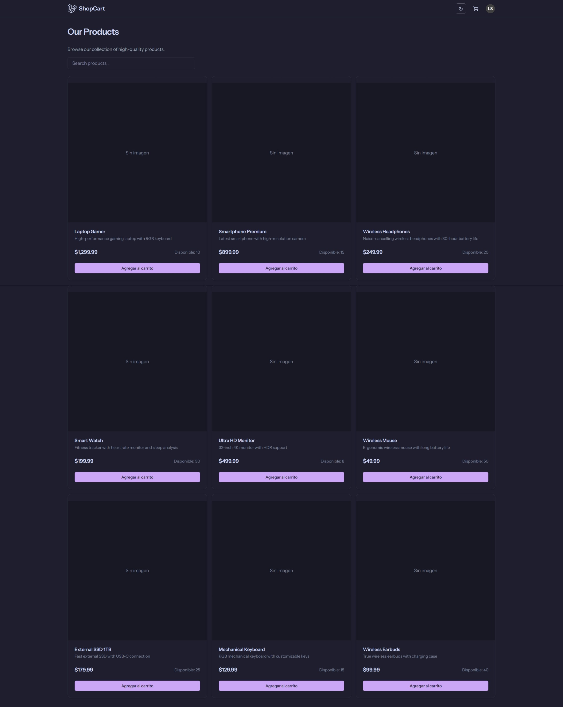
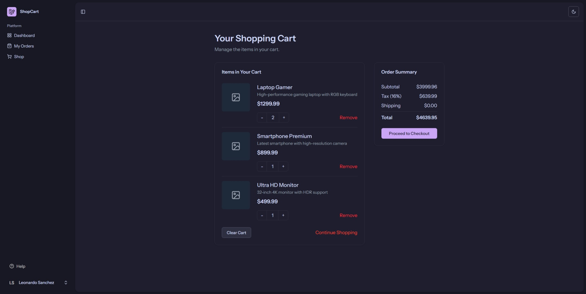
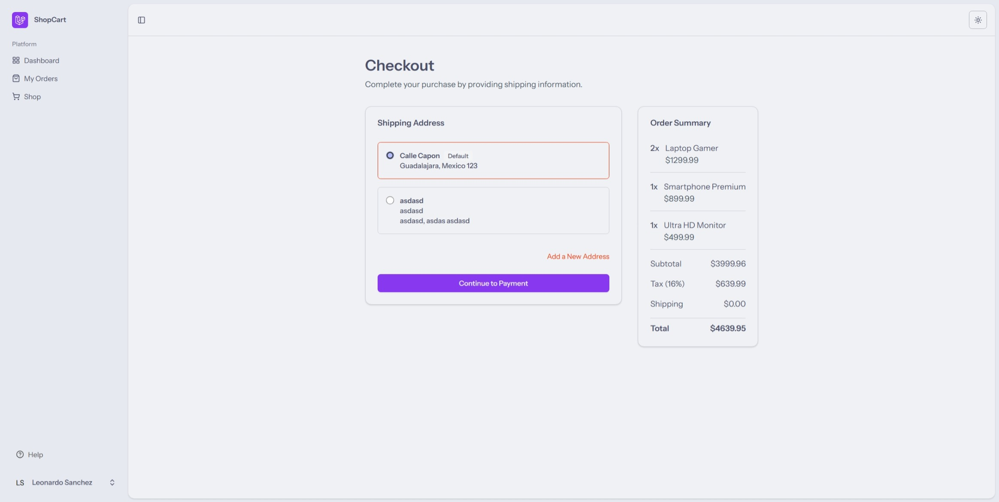
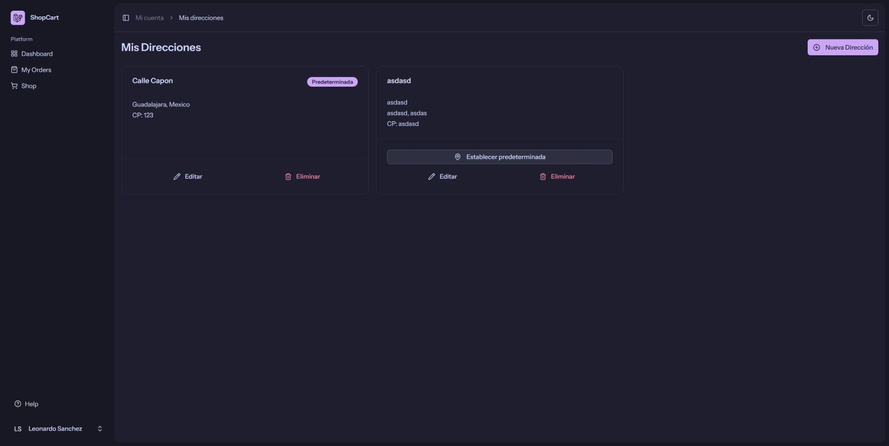

# Prueba1 - Laravel Shopping Cart

## Stack Técnico

- **Backend:** Laravel 12
- **Frontend:** Vue 3 + Inertia.js
- **Base de datos:** PostgreSQL
- **Gestión de dependencias:** Composer, NPM

---

## Uso del Repositorio

1. **Clonar el repositorio**

   ```bash
   git clone https://github.com/mercer2511/Prueba1.git
   cd Prueba1
   ```

2. **Instalar dependencias**

   ```bash
   composer install
   npm install
   ```

3. **Configurar entorno**

   Copia el archivo de entorno y genera la clave:
   ```bash
   cp .env.example .env
   php artisan key:generate
   ```
   Configura tus credenciales de base de datos en `.env`.

4. **Migrar y poblar la base de datos**

   ```bash
   php artisan migrate
   php artisan db:seed
   ```

5. **Construir y levantar el frontend**

   En una terminal:
   ```bash
   npm run dev
   ```

6. **Levantar el servidor Laravel**

   En otra terminal:
   ```bash
   php artisan serve
   ```

---

## Capturas de Pantalla

Vista del dashboard:



Vista de la tienda:



Vista del carrito:



Vista de checkout:



Vista de direcciones:



---

Para más detalles, revisa el código fuente y los comentarios en cada archivo.
